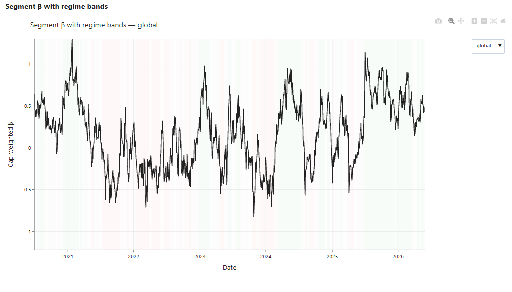
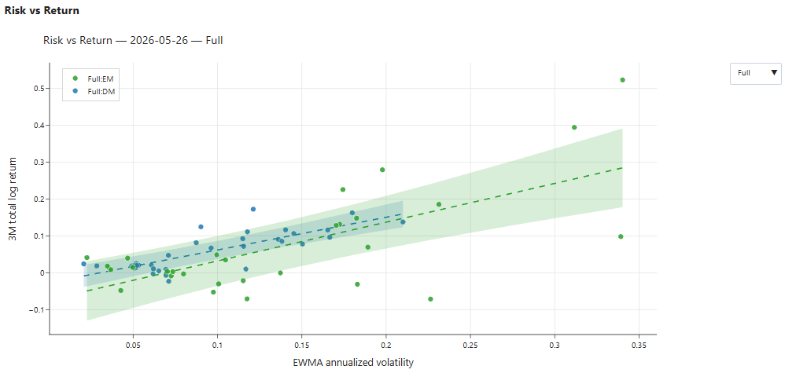
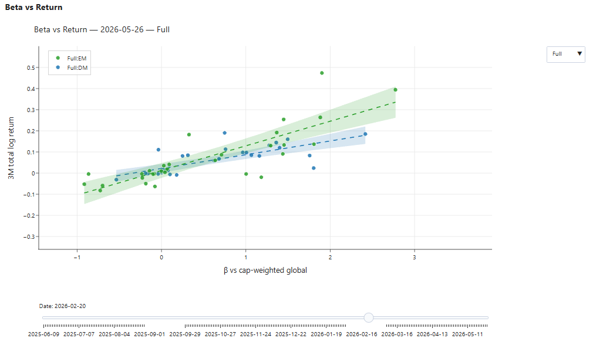

# RoRo — Cross-Asset Risk-Regime Classification Engine

> A daily, reproducible, academically-anchored classifier of the global "risk-on / risk-off" (RoRo) state, estimated from the cross-sectional relationship between realized return and realized volatility across 64 country-level index series, segmented into 10 cuts, and validated against external risk-cycle proxies and internal composite aggregates.

**Author:** Alan Vazquez, CFA
**Status:** v1.0 — *diagnostic only* (no predictive layer)
**License of data:** proprietary (`data.xlsx` is git-ignored); external proxies are free (FRED).



*Cap-weighted cross-sectional price-of-risk (the realized SML slope) for the global universe over ~6 years, shaded by tercile regime band (risk-off red / transitional grey / risk-on green).*

---

## Table of Contents

1. [Abstract](#1-abstract)
2. [Thesis and academic foundations](#2-thesis-and-academic-foundations)
3. [The problem with single-proxy regime measures](#3-the-problem-with-single-proxy-regime-measures)
4. [Data and exploratory analysis](#4-data-and-exploratory-data-analysis)
5. [Methodology](#5-methodology)
6. [System architecture](#6-system-architecture)
7. [The interactive report](#7-the-interactive-report)
8. [Reproducibility](#8-reproducibility)
9. [Testing and acceptance methodology](#9-testing-and-acceptance-methodology)
10. [Installation and usage](#10-installation-and-usage)
11. [Output reference](#11-output-reference)
12. [Limitations and roadmap](#12-limitations-and-roadmap)
13. [References](#13-references)

---

## 1. Abstract

Risk-regime identification is conventionally reduced to reading a single instrument — the VIX level, the high-yield option-adjusted spread, or the slope of the Treasury curve. Each is a noisy, often coincident, single-mechanism proxy that fails silently when its underlying transmission channel breaks. **RoRo** replaces the single-proxy reading with a *cross-sectional* estimator: on every trading day it fits a weighted regression of trailing realized return on trailing realized volatility across the entire investable cross-section of country indices, and interprets the slope of that regression as the market-wide price of risk. A positive, steep slope (high-vol assets out-earning low-vol assets) is a risk-on signature; a flat or inverted slope (vol punished, flight-to-quality) is risk-off.

The slope is computed under two weighting schemes (USD market-cap and equal weight) to isolate the dominance of the United States and China, segmented into ten economically meaningful cuts (DM, EM, Equity, FI, the four DM/EM × Eq/FI intersections, the LatAm bloc, and the global aggregate), classified against its own trailing five-year distribution into terciles, and cross-checked against (a) five external FRED proxies and (b) six composite index aggregates already present in the dataset. A parallel correlation-structure signal (first-principal-component variance share and average pairwise correlation) runs alongside the slope to surface the "everything-moves-together" co-movement spikes that the slope alone can miss.

The engine is a pure, deterministic functional pipeline producing byte-identical CSV artifacts and an interactive HTML report. v1.0 is explicitly **diagnostic**: it characterizes the present regime and its history; it does not forecast the next regime.

---

## 2. Thesis and academic foundations

The central hypothesis is that **the cross-sectional compensation for bearing volatility is a more robust, more leading, and more decomposable measure of the aggregate risk regime than any single time-series proxy.** Three independent literatures support the three pillars of the design.

### Pillar 1 — Cross-sectional return-on-volatility slope (a realized Security Market Line analog)

Classical asset-pricing theory (Sharpe 1964; Lintner 1965) predicts a positive, linear relationship between systematic risk and expected return — the Security Market Line. We estimate the *realized* analog daily: for the cross-section of country indices indexed by `i`, regress the trailing 3-month total return `R_i` on the trailing EWMA volatility `σ_i`:

```
R_i = α + β · σ_i + ε_i
```

The estimated slope `β̂` is the realized price-of-risk. In a risk-on regime, capital chases beta and the realized SML is upward-sloping (`β̂ > 0`); in a risk-off regime, the relationship flattens or inverts as investors pay up for safety and dump high-vol assets, depressing their realized returns. Because this is a *cross-sectional* estimate refreshed daily, it responds at the speed of price action across the whole universe rather than waiting for a single index to confirm.

### Pillar 2 — Cross-sectional correlation structure (Beber, Brandt & Kavajecz, simplified RSDC)

Beber, Brandt & Kavajecz (2013, *Review of Financial Studies*) document that risk regimes are characterized not only by the level of risk premia but by the **correlation structure** of returns: in stressed regimes, cross-asset correlations spike and diversification collapses ("everything moves together"). We operationalize a simplified, static version of their Regime-Switching Dynamic Correlation idea by computing, on the same 3-month window, (a) the **average pairwise correlation** of daily returns across the cross-section and (b) the **variance share explained by the first principal component (PC1)** of the return covariance matrix. A rising PC1 share is a co-movement-concentration signature of stress. Critically, the slope signal and the correlation signal can *disagree* — the slope can read risk-on while correlations are spiking — and the engine explicitly flags these **disagreement events**, which Beber et al. show are themselves informative.

### Pillar 3 — Segmentation under partial market integration (Berkman & Malloch; regional pricing)

Markets are only partially integrated (Berkman & Malloch 2012; Bekaert & Harvey 1995). A single global regime label masks economically real bifurcations — DM risk-on while EM is risk-off, equities risk-on while fixed income signals stress. We therefore re-estimate the cross-sectional slope independently on ten cuts, including a standalone LatAm bloc. The **slope spread** (cap-weighted minus equal-weighted) is an auxiliary signal that isolates the influence of the largest constituents (US equity is ~54% of total DM+EM equity market cap; China ~46% of EM equity) — when the two weighting schemes diverge, the headline regime is being driven by a handful of mega-cap markets rather than by broad participation.

---

## 3. The problem with single-proxy regime measures

| Failure mode | Description |
|---|---|
| **Coincident, not leading** | VIX and HY OAS confirm a regime that is already visible in prices; they rarely anticipate the transition. |
| **No segmentation** | A single global number cannot express "DM risk-on, EM risk-off" or "equity calm, credit stressed." |
| **Silent mechanism failure** | A proxy that depends on one channel (e.g., S&P 500 option demand for the VIX) understates risk when stress propagates through a different channel — e.g., an FX-correlation regime shift (Beber et al. 2013). |
| **No auditability** | Ad-hoc reading of "VIX + HY spread + the dollar" has no formal classification, no reproducibility, and no academic grounding. |

RoRo addresses each: the cross-sectional slope is broad-based (leading), segmented (expressive), multi-mechanism (the correlation pillar catches what the slope misses), and fully reproducible (deterministic pipeline + content hashing).

---

## 4. Data and exploratory data analysis

### 4.1 Universe

The investable universe is **32 countries**, each represented by an equity index and a fixed-income index, for **64 country-level series**. All prices are in **local currency** (FX risk is embedded in local-currency volatility rather than modeled as a separate axis).

- **DM block (17):** United States, Japan, United Kingdom, Canada, France, Switzerland, Germany, Australia, Netherlands, Sweden, Spain, Hong Kong, Italy, Finland, Belgium, Israel, Norway.
- **EM block (15):** China, India, Taiwan, South Korea, Brazil, Singapore, Mexico, South Africa, Indonesia, Thailand, Malaysia, Poland, Chile, Peru, Colombia.
- **LatAm bloc cut (5 × 2 = 10 series):** Brazil, Mexico, Chile, Peru, Colombia.

Six **composite aggregates** (DM/MXWO, EM/MXEF, Europe/MXEU, Asia/MXAS, World/MXWD, LatAm/MXLA, plus matching FI aggregates) are held out of the regression and used purely as **internal consistency checks**.

### 4.2 History and quality

- **Span:** 2008-12-31 → 2026-05-26 (~17.4 years, ~4,540 trading days).
- **Completeness:** no missing values across all 64 country series and 6 aggregates (verified). A defensive *drop-missing* rule is implemented for future refreshes: if an asset is absent on date `t`, it is excluded from that day's cross-section and the realized `N` is recorded.
- **Currency consistency:** USD-quoted bond indices are pre-converted to local currency upstream (spot-checked, e.g. Japan FI ≈ 12,660 JPY vs ≈ 79 USD in May 2026).

### 4.3 The capitalization-concentration finding (the EDA result that shaped the design)

Market-cap weighting was a design risk flagged at review and **confirmed by the data**:

| Block | Equity mcap ($B) | FI mcap ($B) | Concentration |
|---|---:|---:|---|
| DM total | 96,145 | 54,592 | US ≈ 70% of DM equity mcap |
| EM total | 27,095 | 13,330 | China ≈ 46% of EM equity mcap |
| LatAm | 1,626 | 695 | Brazil + Mexico ≈ 78% of LatAm equity mcap |

US equity alone is **~54% of total DM+EM equity market cap.** A purely cap-weighted slope is therefore, to first order, a US slope. This single EDA finding made the **equal-weighted parallel regression and the cap−equal slope spread mandatory rather than optional** — without them, the headline signal silently collapses to a handful of mega-markets. Weights are static, taken from the 2026-05-26 snapshot and applied across all history (a deliberate v1.0 simplification; see Limitations).

### 4.4 Minimum-N discipline

A cut must have `N ≥ 10` series to admit a slope estimate; thinner cuts are flagged and suppressed. The LatAm bloc sits exactly at `N = 10` and is accepted but permanently flagged as a **thin cut**. When a 5-year rolling window has insufficient history for the percentile classifier, the day is flagged **bootstrap** (the 2008-2013 calibration period).

---

## 5. Methodology

Notation: `P_{i,t}` = local-currency price of series `i` on day `t`; `r_{i,t} = ln(P_{i,t}/P_{i,t-1})` = daily log return.

### 5.1 Return and volatility estimators (`roro/returns.py`)

- **3-month total (log) return** over a `W = 63`-trading-day window:
  ```
  R_{i,t} = ln( P_{i,t} / P_{i,t-W} )
  ```
- **EWMA volatility**, RiskMetrics-style, annualized:
  ```
  σ²_{i,t} = λ · σ²_{i,t-1} + (1-λ) · r²_{i,t},   λ = exp(−ln 2 / H)
  σ_annual = σ_t · √252
  ```
  Half-life `H` defaults to 30 trading days (calibrated against 20/40 in the S9 backtest). Implemented via pandas `ewm(halflife=H, adjust=False).std()`.
- **1-month tripwire** (`roro/tripwire.py`): the same machinery on a 21-day return window and 10-day half-life — a faster mirror used to detect transitions before the headline window confirms them.

### 5.2 Cross-sectional regression (`roro/regression.py`)

On each day `t` and each segment, fit return on volatility by **weighted least squares** in closed form:

```
β̂ = (XᵀWX)⁻¹ XᵀWy
```

where `y` is the vector of 3-month returns, `X = [1, σ]` is the design matrix (intercept + annualized vol), and `W` is a diagonal weight matrix. Two schemes run in parallel:

- **Cap-weighted (WLS):** `W = diag(USD market cap)`.
- **Equal-weighted (OLS):** `W = I`.

Outputs per (day, segment, scheme): slope `β̂`, `R²`, realized `N`, and singularity/suppression flags. Near-singular `XᵀWX` is detected and the estimate suppressed rather than returned as noise. The **slope spread** `β̂_cap − β̂_eq` is recorded as the US/China-dominance auxiliary.

### 5.3 Segmentation (`roro/segments.py`)

The universe is partitioned into ten cuts, each re-running §5.2 independently:

`global` (64), `DM` (34), `EM` (30), `Equity` (32), `FI` (32), `DM_Eq` (17), `EM_Eq` (15), `DM_FI` (17), `EM_FI` (15), `LatAm` (10).

### 5.4 Regime classification (`roro/classify.py`)

For each segment, the current slope is ranked against its **trailing 5-year rolling distribution** to produce a percentile, then bucketed:

- **Headline = terciles:** T3 → **Risk-on**, T2 → **Transitional**, T1 → **Risk-off**.
- **Quintiles** and an **asymmetric 20/60/20** scheme are also available (selectable; tercile is default — chosen to keep spurious daily transitions ≤ 2 per calm quarter).
- **Direction flag** (rising / falling / stable): sign of the N-day slope of the beta series itself, compared against the window's own standard deviation.

The tercile-as-headline decision is deliberate: finer buckets increase decision granularity but also increase spurious transitions, which the acceptance gate G5 penalizes.

### 5.5 Correlation-structure signal (`roro/correlation.py`)

On the same 3-month window, per segment:

- **Average pairwise correlation** of daily returns across the cross-section.
- **PC1 variance share:** the largest eigenvalue of the return correlation matrix divided by its trace (`np.linalg.eigvalsh`), i.e. the fraction of cross-sectional variance explained by the first principal component. A rising share is a co-movement-concentration signature of stress.

**Disagreement events** (slope says risk-on while correlation says risk-off, or vice versa) are flagged in `roro/alerts.py`.

### 5.6 External and internal validation (`roro/validation.py`)

- **External:** rolling 60-day correlation of each segment's slope series against five FRED proxies — VIX (`VIXCLS`), US BBB OAS (`BAMLC0A4CBBB`), ICE BofA EM Corporate OAS (`BAMLEMCBPIOAS`), US HY OAS (`BAMLH0A0HYM2`), and the 2s10s curve (`T10Y2Y`). A **degradation alert** fires when `|ρ|` drops below 0.3 over the 60-day window — a diagnostic that the signal's link to known risk instruments has weakened.
- **Internal consistency:** the model's per-segment regime labels are compared against the six composite aggregates already in the dataset. If the model labels the DM cut "risk-off" while the DM composite (MXWO) is making new highs, that gap is surfaced — either segmentation noise or a genuine divergence worth a human's attention.

### 5.7 Per-series beta (visualization layer only, `roro/report/beta_vs_global.py`)

For the scatter plots, each individual country-asset's sensitivity to the market is estimated as a 63-day rolling OLS beta of its daily returns against a cap-weighted global proxy return:

```
β_i = Cov(r_i, r_proxy) / Var(r_proxy)   over a rolling 63-day window
```

This is distinct from the segment-level cross-sectional slope of §5.2 — it is a per-series market beta used only to position points on the "beta vs return" scatter.

---

## 6. System architecture

```
[ data.xlsx ]            [ FRED API ]
   (proprietary)            (free)
        │                      │
        ▼                      ▼
   roro.io.load_panel / load_prices / load_fred
        │
        ▼
   roro.validators  (schema + date-continuity checks)
        │
        ▼
   ┌──────────────────────── roro.engine.run ────────────────────────┐
   │ returns → segments → regression → classify → correlation         │
   │         → validation → tripwire → alerts                         │
   └──────────────────────────────────────────────────────────────────┘
        │
        ▼
   roro.io.write_run   →  outputs/<run-date>/*.csv  +  snapshot.json
        │
        ▼
   roro.report.build_report  →  report.html   (interactive Plotly)
```

**Design principles:**

- **Pure functional pipeline.** Each stage is a pure function over frozen dataclasses (`roro/types.py`). No hidden state, no in-place mutation.
- **Single package, focused modules.** `roro/` holds the engine; `roro/report/` holds the visualization layer, itself a parallel pipeline (`load → figures → html → orchestrate`).
- **Thin CLI over a library.** `roro/cli.py` (Click) exposes `run`, `backtest`, and `report`; everything is importable as a library.
- **Atomic writes.** Run output is written to a `<date>.tmp` directory and renamed on success, so a partial run never corrupts an existing one.

**Engine module map:** `config` (frozen `EngineConfig` + YAML loader), `types` (12 frozen dataclasses), `io` (Excel/FRED ingest + run writer), `validators`, `fred_client` (Protocol + live + mock), `returns`, `segments`, `regression`, `classify`, `correlation`, `validation`, `tripwire`, `alerts`, `engine` (orchestrator), `backtest` (acceptance gates), `cli`.

---

## 7. The interactive report

`roro report` consumes a run directory plus the source `data.xlsx` and emits a single self-contained interactive HTML file (Plotly, loaded from CDN). Three figures:

1. **Risk-return scatter** — x = EWMA annualized volatility, y = 3-month total log return. One marker per country-asset, colored **blue (DM) / green (EM)**, with a **dashed OLS trend line and a 95% confidence ribbon per group**. A **date slider** (trailing 252 business days) animates the snapshot through time; a **segment dropdown** (Full / DM / EM / DM_Eq / EM_Eq / DM_FI / EM_FI) filters the points and **retightens both axes to the selected cluster**.
2. **Beta-return scatter** — identical, with x = per-series 63-day beta vs the cap-weighted global proxy (§5.7).
3. **Segment β time-series** — the cap-weighted slope for a selected segment over the **full available history**, with the background shaded by tercile regime band (Risk-off red / Transitional grey / Risk-on green). A segment dropdown switches the line and its shading.

### Sample output

**Risk vs Return** — cross-section on the run date, x = EWMA annualized volatility, y = 3-month log return. The upward-sloping fit is the risk-on signature (high-vol assets out-earning low-vol assets); EM (green) carries a steeper slope and wider confidence band than DM (blue).



**Beta vs Return** — same cross-section, x = per-series 63-day beta vs the cap-weighted global proxy.



**Segment β with regime bands** — the cap-weighted slope over full history with tercile regime shading and a segment selector.


**Confidence ribbon math.** For an OLS fit `ŷ = a + b·x`, the 95% band uses the standard-error-of-fit
```
SE(ŷ | x) = √( SE_a² + (x − x̄)² · SE_b² ),   band = ŷ ± 1.96 · SE(ŷ | x)
```
evaluated over 50 points across the data range, with slope/intercept standard errors from `scipy.stats.linregress`. Groups with fewer than three finite points skip the ribbon.

The report is **byte-for-byte reproducible** (deterministic Plotly `div_id`s, no embedded timestamps, run date sourced from `snapshot.json`).

---

## 8. Reproducibility

Reproducibility is treated as a first-class requirement, not an afterthought:

- **Content hashing.** Every FRED series is SHA-256 hashed; the source `data.xlsx` is hashed and its mtime recorded. Both land in `snapshot.json`.
- **Code versioning.** The git SHA and dirty-flag of the engine are captured per run.
- **Config capture.** The fully-resolved `EngineConfig` (after YAML + CLI-override merge) is serialized into every run's `snapshot.json`.
- **Determinism tests.** A regression test asserts that two runs over identical inputs produce **byte-identical** CSVs; the report layer has the same guarantee for its HTML.
- **Golden baseline.** A committed `tests/golden/2024-Q1/` fixture locks the integration output (excluding the timestamped `snapshot.json`) against silent drift.

---

## 9. Testing and acceptance methodology

### 9.1 Test stack

- **`pytest`** — unit and integration tests (one test module per engine module).
- **`hypothesis`** — property-based tests for numerical kernels (e.g., the per-series beta is invariant to multiplicative price scaling; β of a series identical to the proxy is exactly 1).
- **`mypy --strict`** — full static typing across `roro/`.
- **`ruff`** — lint (rule sets E, F, I, N, UP, B, SIM, PL). `pytest` runs with `filterwarnings = ["error"]`, so any numerical warning (e.g., a degenerate `linregress`) fails the suite rather than passing silently.

### 9.2 PRD §10 acceptance gates (the `roro backtest` harness)

The backtest replays the engine over a date range and scores six gates. `roro backtest --assert-gates` exits non-zero if any fails. Results land in `backtest/acceptance_report.json`.

| Gate | Criterion | Threshold |
|---|---|---|
| **G1 — VIX coupling** | rolling-60d \|ρ\| between the global slope and VIX | ≥ 0.5 in ≥ 80% of days |
| **G2 — Credit coupling** | rolling-60d \|ρ\| vs US BBB OAS | ≥ 0.4 in ≥ 80% of days |
| **G3 — Event recognition** | model registers risk-off around 8 historical episodes | all 8 matched within a ±6-business-day window |
| **G4 — Segmentation lift** | DM vs EM tercile labels differ by ≥ 2 ordinal buckets | on ≥ 20% of days (proves segmentation adds information) |
| **G5 — Stability** | bucket transitions during *calm* quarters (below-median realized vol) | ≤ 2 transitions in the worst calm quarter |
| **G6 — Internal consistency** | model-vs-composite tercile-gap breaches in any rolling 30-day window | ≤ 5 |

The eight G3 episodes: 2010 Greek crisis, 2011 Eurozone / US downgrade, 2015 China devaluation, 2018 Q4 selloff, 2020 COVID, 2022 January rate shock, 2022 September rate shock, and the 2008 Lehman bootstrap-calibration period.

`run_backtest` also emits `event_recognition.csv`, `validation_corr_history.csv`, and `stability_metrics.csv` for forensic review.

---

## 10. Installation and usage

### Install

```bash
uv venv && uv pip install -e ".[dev]"
```

### Configure the FRED key

The engine needs a free [FRED API key](https://fred.stlouisfed.org/docs/api/api_key.html). Either export it for the session, or store it locally (git-ignored, persists):

```bash
export FRED_API_KEY="..."          # Linux/macOS
$env:FRED_API_KEY = "..."          # Windows PowerShell

# or:
cp .env.example .env               # then edit .env (never commit it)
```

> **Security:** `.env` is git-ignored; `.env.example` must only ever contain the placeholder. Never paste a real key into a tracked file.

### Daily run

```bash
roro run --config configs/default.yaml --date 2026-05-27 --as-of-data-date 2026-05-26
```

Produces `outputs/2026-05-27/` (see §11).

### Build the report

```bash
roro report --run-dir outputs/2026-05-27 --window 252 --out outputs/2026-05-27/report.html
```

`--xlsx` defaults to the `data_path` recorded in the run's `snapshot.json`.

### Backtest with acceptance gates

```bash
roro backtest --config configs/default.yaml --start 2010-01-01 --end 2024-12-31 --assert-gates
```

### Development gates

```bash
uv run pytest          # full suite (unit + property + integration + golden)
uv run mypy --strict roro/
uv run ruff check .
```

---

## 11. Output reference

A run directory (`outputs/<run-date>/`) contains:

| File | Contents |
|---|---|
| `beta_series.csv` | Per-segment slope under both schemes (`beta`, `r2`, `n`, `suppressed`, `singular`) for cap-weighted and equal-weighted; the slope spread is derivable. |
| `regimes.csv` | Per (date, segment): 5Y percentile, tercile, quintile, direction, realized `N`, `thin_cut`, `bootstrap` flags. |
| `correlation.csv` | Per segment: average pairwise correlation, PC1 variance share. |
| `external_validation.csv` | Rolling-60d ρ of each segment slope vs each FRED proxy. |
| `tripwire.csv` | The 1-month fast-signal mirror of the slope. |
| `alerts.csv` | Bucket transitions, disagreement events, validation-degradation events. |
| `snapshot.json` | Resolved config, data fingerprint (SHA-256 + mtime), FRED hashes, code version, warnings. |
| `report.html` | (from `roro report`) the interactive three-figure dashboard. |

---

## 12. Limitations and roadmap

**v1.0 is diagnostic, not predictive.** It characterizes the current and historical regime; it does not forecast the next one.

Known v1.0 simplifications:

- **Static market-cap weights.** The 2026-05-26 cap snapshot is applied across all 17 years. This biases historical cap-weighted slopes toward the *current* concentration profile; the equal-weighted parallel and the slope spread are the mitigants.
- **Local-currency volatility only.** FX risk is embedded, not separated. No FX overlay.
- **Simplified correlation pillar.** A static PC1/avg-pairwise proxy stands in for the full Beber et al. Regime-Switching Dynamic Correlation model.
- **Composite price wiring for internal consistency is partial** in the engine v1.

Roadmap:

- **v1.1** — GFP (Miranda-Agrippino & Rey global financial cycle factor) as a sixth external validator; rolling/time-varying cap weights.
- **v2.0** — predictive layer based on Beber-style transition *persistence* (not realized-return forecasts), only after the diagnostic validates against the external proxies and internal aggregates.
- **Engineering** — split the visualization `figures.py` into `_scatter.py` / `_beta_ts.py`; address interactive-report payload size for long windows.

---

## 13. References

- Sharpe, W. F. (1964). "Capital Asset Prices: A Theory of Market Equilibrium under Conditions of Risk." *Journal of Finance.*
- Lintner, J. (1965). "The Valuation of Risk Assets and the Selection of Risky Investments in Stock Portfolios and Capital Budgets." *Review of Economics and Statistics.*
- Bekaert, G., & Harvey, C. R. (1995). "Time-Varying World Market Integration." *Journal of Finance.*
- Berkman, H., & Malloch, H. (2012). Partial integration and regional pricing of equity risk.
- Beber, A., Brandt, M. W., & Kavajecz, K. A. (2013). "What Does Equity Sector Order-Flow Tell Us About the Economy?" and related work on regime-switching dynamic correlations. *Review of Financial Studies.*
- Miranda-Agrippino, S., & Rey, H. (2020). "U.S. Monetary Policy and the Global Financial Cycle." *Review of Economic Studies.*

> Full design rationale: `docs/superpowers/specs/` (engine + viz design specs) and `docs/prd/PRD.md`.
