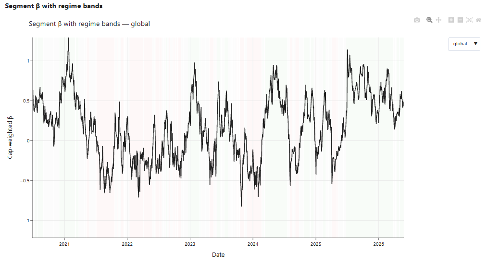
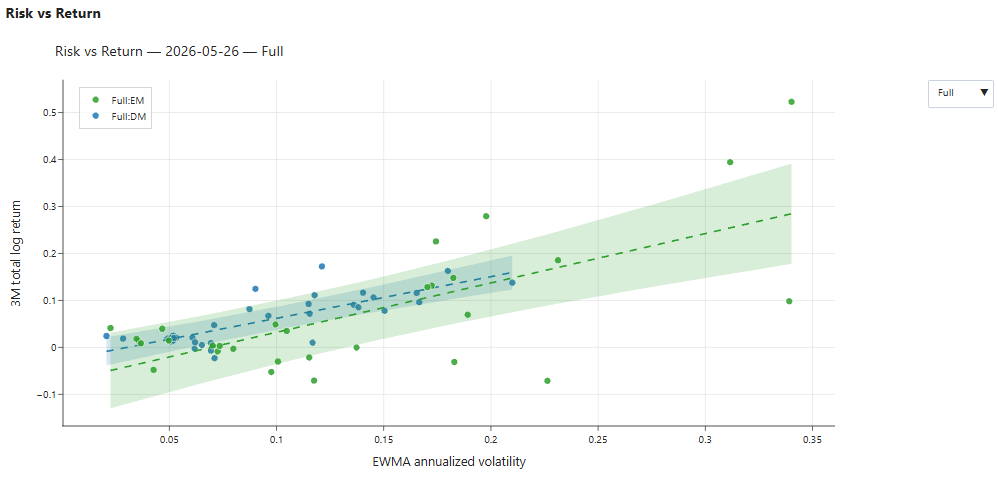
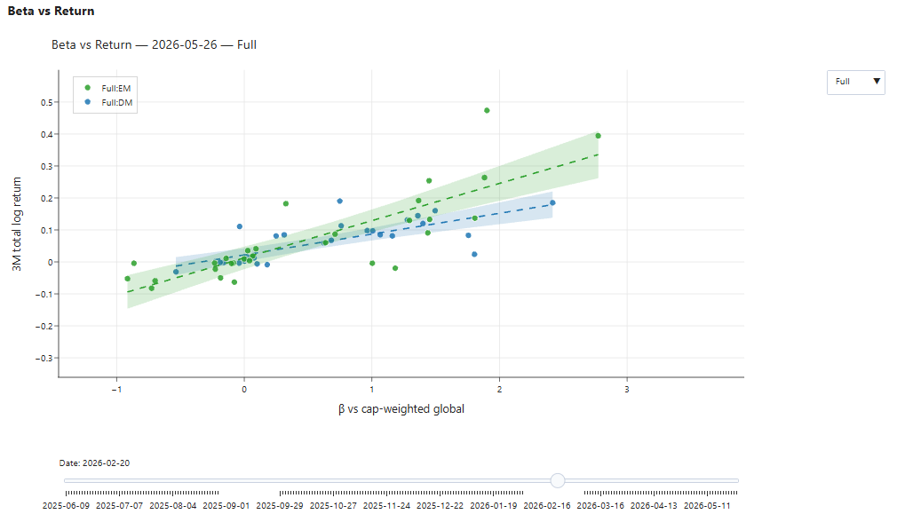
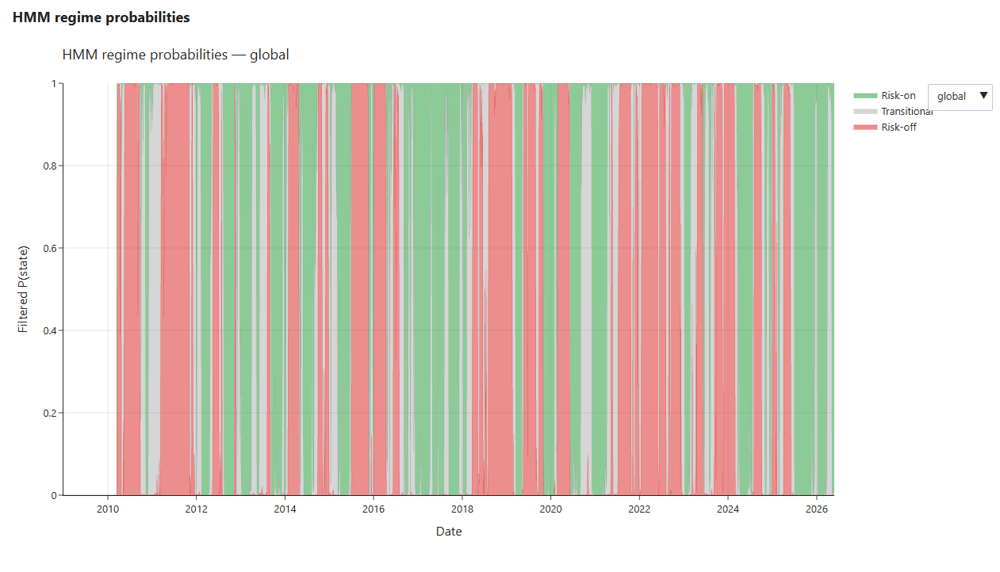

# RoRo — Cross-Asset Risk-Regime Classification Engine

> A daily, reproducible, academically-anchored classifier of the global "risk-on / risk-off" (RoRo) state, estimated from the cross-sectional relationship between realized return and realized volatility across 64 country-level index series, segmented into 10 cuts, and validated against external risk-cycle proxies and internal composite aggregates.

**Author:** Alan Vazquez, CFA
**Status:** v1.1 — *diagnostic only* (no predictive layer). Adds two optional, off-by-default regime overlays — an **HMM / Markov-switching** model and a **Statistical Jump Model** — alongside the production-default percentile/tercile classifier, plus **regime attribution** — an exact, residual-free per-asset decomposition of the slope with its own five report figures, on by default and additive only — and an expanded interactive report (per-overlay state-probability figures + a Percentile ↔ HMM ↔ JM band toggle + volatility-breadth heatmaps). All three classifiers are scored through the same acceptance gates.
**License of data:** proprietary (`data.xlsx` is git-ignored); external proxies are free (FRED).



*Cap-weighted cross-sectional price-of-risk (the realized SML slope) for the global universe over ~6 years, shaded by tercile regime band (risk-off red / transitional grey / risk-on green).*

---

## Table of Contents

1. [Abstract](#1-abstract)
2. [Thesis and academic foundations](#2-thesis-and-academic-foundations)
3. [The problem with single-proxy regime measures](#3-the-problem-with-single-proxy-regime-measures)
4. [Data and exploratory analysis](#4-data-and-exploratory-data-analysis)
5. [Methodology](#5-methodology)
6. [System architecture](#6-system-architecture)
7. [The interactive report](#7-the-interactive-report)
8. [Reproducibility](#8-reproducibility)
9. [Testing and acceptance methodology](#9-testing-and-acceptance-methodology)
10. [Installation and usage](#10-installation-and-usage)
11. [Output reference](#11-output-reference)
12. [Limitations and roadmap](#12-limitations-and-roadmap)
13. [References](#13-references)

---

## 1. Abstract

Risk-regime identification is conventionally reduced to reading a single instrument — the VIX level, the high-yield option-adjusted spread, or the slope of the Treasury curve. Each is a noisy, often coincident, single-mechanism proxy that fails silently when its underlying transmission channel breaks. **RoRo** replaces the single-proxy reading with a *cross-sectional* estimator: on every trading day it fits a weighted regression of trailing realized return on trailing realized volatility across the entire investable cross-section of country indices, and interprets the slope of that regression as the market-wide price of risk. A positive, steep slope (high-vol assets out-earning low-vol assets) is a risk-on signature; a flat or inverted slope (vol punished, flight-to-quality) is risk-off.

The slope is computed under two weighting schemes (USD market-cap and equal weight) to isolate the dominance of the United States and China, segmented into ten economically meaningful cuts (DM, EM, Equity, FI, the four DM/EM × Eq/FI intersections, the LatAm bloc, and the global aggregate), classified against its own trailing five-year distribution into terciles, and cross-checked against (a) five external FRED proxies and (b) six composite index aggregates already present in the dataset. A parallel correlation-structure signal (first-principal-component variance share and average pairwise correlation) runs alongside the slope to surface the "everything-moves-together" co-movement spikes that the slope alone can miss.

The engine is a pure, deterministic functional pipeline producing byte-identical CSV artifacts and an interactive HTML report. v1.0 is explicitly **diagnostic**: it characterizes the present regime and its history; it does not forecast the next regime.

---

## 2. Thesis and academic foundations

The central hypothesis is that **the cross-sectional compensation for bearing volatility is a more robust, more leading, and more decomposable measure of the aggregate risk regime than any single time-series proxy.** Three independent literatures support the three pillars of the design.

### Pillar 1 — Cross-sectional return-on-volatility slope (a realized Security Market Line analog)

Classical asset-pricing theory (Sharpe 1964; Lintner 1965) predicts a positive, linear relationship between systematic risk and expected return — the Security Market Line. We estimate the *realized* analog daily: for the cross-section of country indices indexed by `i`, regress the trailing 3-month total return `R_i` on the trailing EWMA volatility `σ_i`:

```
R_i = α + β · σ_i + ε_i
```

The estimated slope `β̂` is the realized price-of-risk. In a risk-on regime, capital chases beta and the realized SML is upward-sloping (`β̂ > 0`); in a risk-off regime, the relationship flattens or inverts as investors pay up for safety and dump high-vol assets, depressing their realized returns. Because this is a *cross-sectional* estimate refreshed daily, it responds at the speed of price action across the whole universe rather than waiting for a single index to confirm.

### Pillar 2 — Cross-sectional correlation structure (Beber, Brandt & Kavajecz, simplified RSDC)

Beber, Brandt & Kavajecz (2013, *Review of Financial Studies*) document that risk regimes are characterized not only by the level of risk premia but by the **correlation structure** of returns: in stressed regimes, cross-asset correlations spike and diversification collapses ("everything moves together"). We operationalize a simplified, static version of their Regime-Switching Dynamic Correlation idea by computing, on the same 3-month window, (a) the **average pairwise correlation** of daily returns across the cross-section and (b) the **variance share explained by the first principal component (PC1)** of the return covariance matrix. A rising PC1 share is a co-movement-concentration signature of stress. Critically, the slope signal and the correlation signal can *disagree* — the slope can read risk-on while correlations are spiking — and the engine explicitly flags these **disagreement events**, which Beber et al. show are themselves informative.

### Pillar 3 — Segmentation under partial market integration (Berkman & Malloch; regional pricing)

Markets are only partially integrated (Berkman & Malloch 2012; Bekaert & Harvey 1995). A single global regime label masks economically real bifurcations — DM risk-on while EM is risk-off, equities risk-on while fixed income signals stress. We therefore re-estimate the cross-sectional slope independently on ten cuts, including a standalone LatAm bloc. The **slope spread** (cap-weighted minus equal-weighted) is an auxiliary signal that isolates the influence of the largest constituents (US equity is ~54% of total DM+EM equity market cap; China ~46% of EM equity) — when the two weighting schemes diverge, the headline regime is being driven by a handful of mega-cap markets rather than by broad participation.

---

## 3. The problem with single-proxy regime measures

| Failure mode | Description |
|---|---|
| **Coincident, not leading** | VIX and HY OAS confirm a regime that is already visible in prices; they rarely anticipate the transition. |
| **No segmentation** | A single global number cannot express "DM risk-on, EM risk-off" or "equity calm, credit stressed." |
| **Silent mechanism failure** | A proxy that depends on one channel (e.g., S&P 500 option demand for the VIX) understates risk when stress propagates through a different channel — e.g., an FX-correlation regime shift (Beber et al. 2013). |
| **No auditability** | Ad-hoc reading of "VIX + HY spread + the dollar" has no formal classification, no reproducibility, and no academic grounding. |

RoRo addresses each: the cross-sectional slope is broad-based (leading), segmented (expressive), multi-mechanism (the correlation pillar catches what the slope misses), and fully reproducible (deterministic pipeline + content hashing).

---

## 4. Data and exploratory data analysis

### 4.1 Universe

The investable universe is **32 countries**, each represented by an equity index and a fixed-income index, for **64 country-level series**. All prices are in **local currency** (FX risk is embedded in local-currency volatility rather than modeled as a separate axis).

- **DM block (17):** United States, Japan, United Kingdom, Canada, France, Switzerland, Germany, Australia, Netherlands, Sweden, Spain, Hong Kong, Italy, Finland, Belgium, Israel, Norway.
- **EM block (15):** China, India, Taiwan, South Korea, Brazil, Singapore, Mexico, South Africa, Indonesia, Thailand, Malaysia, Poland, Chile, Peru, Colombia.
- **LatAm bloc cut (5 × 2 = 10 series):** Brazil, Mexico, Chile, Peru, Colombia.

Six **composite aggregates** (DM/MXWO, EM/MXEF, Europe/MXEU, Asia/MXAS, World/MXWD, LatAm/MXLA, plus matching FI aggregates) are held out of the regression and used purely as **internal consistency checks**.

### 4.2 History and quality

- **Span:** 2008-12-31 → 2026-05-26 (~17.4 years, ~4,540 trading days).
- **Completeness:** no missing values across all 64 country series and 6 aggregates (verified). A defensive *drop-missing* rule is implemented for future refreshes: if an asset is absent on date `t`, it is excluded from that day's cross-section and the realized `N` is recorded.
- **Currency consistency:** USD-quoted bond indices are pre-converted to local currency upstream (spot-checked, e.g. Japan FI ≈ 12,660 JPY vs ≈ 79 USD in May 2026).

### 4.3 The capitalization-concentration finding (the EDA result that shaped the design)

Market-cap weighting was a design risk flagged at review and **confirmed by the data**:

| Block | Equity mcap ($B) | FI mcap ($B) | Concentration |
|---|---:|---:|---|
| DM total | 96,145 | 54,592 | US ≈ 70% of DM equity mcap |
| EM total | 27,095 | 13,330 | China ≈ 46% of EM equity mcap |
| LatAm | 1,626 | 695 | Brazil + Mexico ≈ 78% of LatAm equity mcap |

US equity alone is **~54% of total DM+EM equity market cap.** A purely cap-weighted slope is therefore, to first order, a US slope. This single EDA finding made the **equal-weighted parallel regression and the cap−equal slope spread mandatory rather than optional** — without them, the headline signal silently collapses to a handful of mega-markets. Weights are static, taken from the 2026-05-26 snapshot and applied across all history (a deliberate v1.0 simplification; see Limitations).

### 4.4 Minimum-N discipline

A cut must have `N ≥ 10` series to admit a slope estimate; thinner cuts are flagged and suppressed. The LatAm bloc sits exactly at `N = 10` and is accepted but permanently flagged as a **thin cut**. When a 5-year rolling window has insufficient history for the percentile classifier, the day is flagged **bootstrap** (the 2008-2013 calibration period).

---

## 5. Methodology

Notation: `P_{i,t}` = local-currency price of series `i` on day `t`; `r_{i,t} = ln(P_{i,t}/P_{i,t-1})` = daily log return.

### 5.1 Return and volatility estimators (`roro/returns.py`)

- **3-month total (log) return** over a `W = 63`-trading-day window:
  ```
  R_{i,t} = ln( P_{i,t} / P_{i,t-W} )
  ```
- **EWMA volatility**, RiskMetrics-style, annualized:
  ```
  σ²_{i,t} = λ · σ²_{i,t-1} + (1-λ) · r²_{i,t},   λ = exp(−ln 2 / H)
  σ_annual = σ_t · √252
  ```
  Half-life `H` defaults to 30 trading days (calibrated against 20/40 in the S9 backtest). Implemented via pandas `ewm(halflife=H, adjust=False).std()`.
- **1-month tripwire** (`roro/tripwire.py`): the same machinery on a 21-day return window and 10-day half-life — a faster mirror used to detect transitions before the headline window confirms them.

### 5.2 Cross-sectional regression (`roro/regression.py`)

On each day `t` and each segment, fit return on volatility by **weighted least squares** in closed form:

```
β̂ = (XᵀWX)⁻¹ XᵀWy
```

where `y` is the vector of 3-month returns, `X = [1, σ]` is the design matrix (intercept + annualized vol), and `W` is a diagonal weight matrix. Two schemes run in parallel:

- **Cap-weighted (WLS):** `W = diag(USD market cap)`.
- **Equal-weighted (OLS):** `W = I`.

Outputs per (day, segment, scheme): slope `β̂`, `R²`, realized `N`, and singularity/suppression flags. Near-singular `XᵀWX` is detected and the estimate suppressed rather than returned as noise. The **slope spread** `β̂_cap − β̂_eq` is recorded as the US/China-dominance auxiliary.

### 5.3 Segmentation (`roro/segments.py`)

The universe is partitioned into ten cuts, each re-running §5.2 independently:

`global` (64), `DM` (34), `EM` (30), `Equity` (32), `FI` (32), `DM_Eq` (17), `EM_Eq` (15), `DM_FI` (17), `EM_FI` (15), `LatAm` (10).

### 5.4 Regime classification (`roro/classify.py`)

For each segment, the current slope is ranked against its **trailing 5-year rolling distribution** to produce a percentile, then bucketed:

- **Headline = terciles:** T3 → **Risk-on**, T2 → **Transitional**, T1 → **Risk-off**.
- **Quintiles** and an **asymmetric 20/60/20** scheme are also available (selectable; tercile is default — chosen to keep spurious daily transitions ≤ 2 per calm quarter).
- **Direction flag** (rising / falling / stable): sign of the N-day slope of the beta series itself, compared against the window's own standard deviation.

The tercile-as-headline decision is deliberate: finer buckets increase decision granularity but also increase spurious transitions, which the acceptance gate G5 penalizes.

#### 5.4.1 Optional HMM / Markov-switching overlay (`roro/regime_hmm.py`)

The percentile classifier labels a regime by where today's slope sits in its own distribution; it carries no notion of regime *persistence*, so the raw daily tercile flickers. As an **optional, off-by-default** alternative (`hmm_enabled`, default `False`), the engine can fit a **3-state Markov-switching model** to each segment's cap-weighted slope series — regime-dependent **mean and variance** (`statsmodels` `MarkovRegression`, `switching_variance=True`) — mapping the three states, ordered by fitted mean, to **Risk-off / Transitional / Risk-on**. A learned transition matrix gives persistence intrinsically (no post-hoc smoothing), plus soft **filtered state probabilities** per day.

The overlay is **causal by construction**: parameters are re-estimated on an **expanding window** (monthly refit) and states are inferred by the **Hamilton filter** (filtered, never smoothed — no lookahead). This is verified two ways: a no-lookahead property test (a label at date *t* is unchanged when future data is appended), and a cadence-invariance bench showing **monthly ≈ daily refit (0.9966 label agreement)**, so the cheaper monthly cadence is a safe default.

When enabled, both methods are scored through the same §9 acceptance gates and a comparison report is written. On the full 2008–2026 backtest the **percentile classifier remains the production default**: the HMM passed no gate outright and slightly regressed event recognition (G3 6/8 vs 7/8) but **halved the calm-quarter flicker (G5 9 vs 18 transitions)** — directionally validating the persistence thesis without clearing the strict bars. It therefore ships as an overlay, not a replacement. EM mean-sorted state ordering is re-canonicalized at every refit to defeat EM label-switching; degenerate/non-converged fits fall back to the previous good parameters.

#### 5.4.2 Optional Statistical Jump Model overlay (`roro/regime_jm.py`)

A second optional overlay (`jm_enabled`, default `False`) fits a **3-state statistical jump model** (Bemporad et al. 2018; Nystrup et al. 2020; Shu & Mulvey 2024) to each segment's cap-weighted slope. Where the HMM learns a transition *matrix*, the JM imposes persistence with a single **fixed jump penalty** `λ`: it minimizes clustering loss plus `λ · (number of regime transitions)`. That structural cost holds regimes through noise **without** the lag a learned transition matrix imposes on sharp moves — the thesis being a less-flickering label than the percentile classifier that still snaps cleanly on genuine breaks. The three centroids are ordered by fitted mean → Risk-off / Transitional / Risk-on.

Like the HMM, the JM is **causal by construction** (parameters re-fit on an expanding/rolling point-in-time window; states inferred by a forward-only dynamic-programming filter — no lookahead) and **deterministic** (seeded k-means++ initialization via NumPy `PCG64`, byte-identical CSV output is enforced by a regression test). It is **vendored as a small dependency-free NumPy module** rather than pulling in `scikit-learn`, to keep the determinism guarantee under the project's pinned toolchain. A continuous variant (`jm_continuous: true`) emits soft per-day state probabilities for the report's stacked-area figure. The JM ships off by default; promotion to production default is reserved for a documented decision once it clears the persistence gate (G5) without regressing event recognition (G3) — the exact bar the HMM could not meet. Full design: `docs/superpowers/specs/2026-06-09-jm-regime-design.md`.

### 5.5 Correlation-structure signal (`roro/correlation.py`)

On the same 3-month window, per segment:

- **Average pairwise correlation** of daily returns across the cross-section.
- **PC1 variance share:** the largest eigenvalue of the return correlation matrix divided by its trace (`np.linalg.eigvalsh`), i.e. the fraction of cross-sectional variance explained by the first principal component. A rising share is a co-movement-concentration signature of stress.

**Disagreement events** (slope says risk-on while correlation says risk-off, or vice versa) are flagged in `roro/alerts.py`.

### 5.6 External and internal validation (`roro/validation.py`)

- **External:** rolling 60-day correlation of each segment's slope series against five FRED proxies — VIX (`VIXCLS`), US BBB OAS (`BAMLC0A4CBBB`), ICE BofA EM Corporate OAS (`BAMLEMCBPIOAS`), US HY OAS (`BAMLH0A0HYM2`), and the 2s10s curve (`T10Y2Y`). A **degradation alert** fires when `|ρ|` drops below 0.3 over the 60-day window — a diagnostic that the signal's link to known risk instruments has weakened.
- **Internal consistency:** the model's per-segment regime labels are compared against the six composite aggregates already in the dataset. If the model labels the DM cut "risk-off" while the DM composite (MXWO) is making new highs, that gap is surfaced — either segmentation noise or a genuine divergence worth a human's attention.

### 5.7 Per-series beta (visualization layer only, `roro/report/beta_vs_global.py`)

For the scatter plots, each individual country-asset's sensitivity to the market is estimated as a 63-day rolling OLS beta of its daily returns against a cap-weighted global proxy return:

```
β_i = Cov(r_i, r_proxy) / Var(r_proxy)   over a rolling 63-day window
```

This is distinct from the segment-level cross-sectional slope of §5.2 — it is a per-series market beta used only to position points on the "beta vs return" scatter.

### 5.8 Regime attribution (`roro/attribution.py`)

The slope of §5.2 is a WLS fit, and a WLS slope is **linear in the returns**. That makes it decomposable exactly — no residual, no approximation:

```
β̂ = Σ_i c_i ,   c_i = h_i · y_i ,   h_i = w_i (x_i − x̄) / D
x̄ = Σ_i w_i x_i ,   D = Σ_i w_i (x_i − x̄)² ,   Σ_i w_i = 1
```

Because `Σ_i w_i (x_i − x̄) = 0`, the intercept drops out and the per-asset contributions `c_i` sum to the published `β̂`. The attribution consumes the *identical* daily panel the slope is fitted on; `regression.py` is never touched.

- **Quadrants.** Each series is tagged by where it sits relative to the weighted mean vol `x̄` and the sign of its return: `HI/+`, `HI/−`, `LO/+`, `LO/−`. `HI/+` and `LO/−` push the slope up (the risk-on signature); `HI/−` and `LO/+` push it down.
- **Δβ̂ waterfall.** The move in `β̂` from an anchor date to today is split into four additive effects — **return** (the same names earning differently), **position** (names moving in vol space, i.e. changed leverage `h_i`), **interaction** (the cross term), and **universe** (series entering or leaving the cut). The anchor is the last regime transition (searched back at most `attribution_anchor_lookback_days`); a fixed `attribution_fixed_horizon_days` window is computed in parallel.
- **Concentration.** Per (date, cut, weighting): the **HHI** of contribution shares, the **top-1** and **top-5** shares, and a **leave-one-out** slope `beta_ex_top1` recomputed with the largest contributor dropped. `fragile_flag` (cap-weighted only) marks the days where dropping that one name changes the regime read — the honest robustness statement about a single-name-driven slope. Concentration alerts land in `alerts.csv` (kind `concentration`); fragility alerts are suppressed on thin cuts.
- **PC1 cross-check.** Per-series squared PC1 loadings against the cut's PC1 variance share, plus a `decoupling` measure — a series carrying the slope while sitting off the dominant co-movement axis is a different story from one that simply rides the factor.

Attribution is **on by default** (`attribution_enabled: true`) and is **additive only**: it writes new artifacts and never alters an existing number. Setting `attribution_enabled: false` reproduces every legacy artifact byte-identically.

---

## 6. System architecture

```
[ data.xlsx ]            [ FRED API ]
   (proprietary)            (free)
        │                      │
        ▼                      ▼
   roro.io.load_panel / load_prices / load_fred
        │
        ▼
   roro.validators  (schema + date-continuity checks)
        │
        ▼
   ┌──────────────────────── roro.engine.run ────────────────────────┐
   │ returns → segments → regression → classify [→ classify_hmm*]      │
   │         → correlation → validation → tripwire → attribution†      │
   │         → alerts                                                  │
   └──────────────────────────────────────────────────────────────────┘
            * optional HMM overlay, only when hmm_enabled (§5.4.1)
            † regime attribution, on by default; adds artifacts only (§5.5)
        │
        ▼
   roro.io.write_run   →  outputs/<run-date>/*.csv  +  snapshot.json
        │
        ▼
   roro.report.build_report  →  report.html   (interactive Plotly)
```

**Design principles:**

- **Pure functional pipeline.** Each stage is a pure function over frozen dataclasses (`roro/types.py`). No hidden state, no in-place mutation.
- **Single package, focused modules.** `roro/` holds the engine; `roro/report/` holds the visualization layer, itself a parallel pipeline (`load → figures → html → orchestrate`).
- **Thin CLI over a library.** `roro/cli.py` (Click) exposes `run`, `backtest`, and `report`; everything is importable as a library.
- **Atomic writes.** Run output is written to a `<date>.tmp` directory and renamed on success, so a partial run never corrupts an existing one.

**Engine module map:** `config` (frozen `EngineConfig` + YAML loader), `types` (frozen dataclasses), `io` (Excel/FRED ingest + run writer), `validators`, `fred_client` (Protocol + live + mock), `returns`, `segments`, `regression`, `classify`, `regime_hmm` (optional HMM overlay, §5.4.1), `jump_model` + `regime_jm` (optional vendored Jump Model overlay, §5.4.2), `correlation`, `validation`, `tripwire`, `attribution` (exact per-asset decomposition of the slope + its own orchestrator over cuts, weightings and dates, §5.5), `alerts`, `engine` (orchestrator), `backtest` (acceptance gates + multi-method comparison), `cli`. The report layer adds `roro/report/vol_breadth.py` (realized-vol percentile matrix) and `roro/report/attribution_figs.py` (the five attribution figures) alongside `load → figures → html → orchestrate`.

---

## 7. The interactive report

`roro report` consumes a run directory plus the source `data.xlsx` and emits a single self-contained interactive HTML file (Plotly, loaded from CDN). It renders **up to 10 figures on a standard run** — the five core figures plus the **five regime-attribution figures**, each of the latter gated independently on the presence of its artifact in the run directory — and one further state-probability figure for each regime overlay present in the run (one for HMM, one for JM):

1. **Risk-return scatter** — x = EWMA annualized volatility, y = 3-month total log return. One marker per country-asset, colored **blue (DM) / green (EM)**, with a **dashed OLS trend line and a 95% confidence ribbon per group**. A **date slider** (trailing 252 business days) animates the snapshot through time; a **segment dropdown** (Full / DM / EM / DM_Eq / EM_Eq / DM_FI / EM_FI) filters the points and **retightens both axes to the selected cluster**.
2. **Beta-return scatter** — identical, with x = per-series 63-day beta vs the cap-weighted global proxy (§5.7).
3. **Segment β time-series** — the cap-weighted slope for a selected segment over the **full available history**, with the background shaded by tercile regime band (Risk-off red / Transitional grey / Risk-on green). A segment dropdown switches the line and its shading. When the run carries overlay output, a **band-source toggle (Percentile ↔ HMM ↔ JM)** above this chart swaps the shaded bands on the same β line between whichever methods are present — directly contrasting the hysteresis-smoothed percentile bands with the intrinsically-persistent HMM and JM bands.
4. **HMM / JM regime probabilities** *(one figure per enabled overlay)* — a per-segment **stacked area of the three state probabilities** (Risk-off / Transitional / Risk-on, summing to 1.0) over full history: filtered probabilities for the HMM, soft state probabilities for the continuous JM (one-hot steps for the discrete JM). A thin dominant band signals low model confidence; the warmup region is left blank. The soft view the percentile hard labels cannot express.
5. **Volatility breadth (sorted-rank)** — a heatmap answering *how many* assets trade at elevated volatility versus their own history. Each day, the cross-section of per-series **63-day realized-vol percentiles** (ranked against each series' expanding ≥5-year history) is **sorted descending**; the thickness of the bright band at the top is the count of stressed assets. Plasma colorscale; an **All / Eq / FI class toggle**.
6. **Volatility percentile by asset** — the same data as a per-series identity heatmap (one fixed row per series, ordered by mean percentile), showing *which* assets are stressed and letting you track one over time. Same Plasma scale and class toggle.

The next five figures render only when the run carries the matching attribution artifact (§5.8, §11); a run with `attribution_enabled: false` simply omits them.

7. **Slope attribution** — a horizontal bar chart of the top-N per-asset contributions `c_i` to the selected cut's slope on the run date, colored by quadrant (`HI/+` `HI/−` `LO/+` `LO/−`). The chart title carries the reconstructed `β̂`, so the bars visibly sum to the published number. Cut and weighting (cap / eq) dropdowns.
8. **Δβ̂ waterfall** — the move in `β̂` **since the last regime transition** decomposed into its four additive effects (return / position / interaction / universe), bridging `β̂_anchor` to `β̂_t`. The anchor date and both endpoint labels are on the chart; the fixed-horizon variant is available in the CSV.
9. **Vol vs return, sized by |contribution|** — the familiar risk-return cross-section, but each marker is **sized by `|c_i|`** and the fitted line is the **exact WLS slope** the engine publishes (not a re-fit). Reference lines at `x̄` and `ȳ` split the plane into the four quadrants, so the names doing the work are visible at a glance.
10. **Concentration of the slope** — the full history of **top-1 share** and **HHI** for the selected cut and weighting, shaded with the tercile regime bands. This is the figure that shows whether today's reading rests on one name or on the cross-section.
11. **PC1 loadings vs variance share** — per-series squared PC1 loadings for the selected cut against the cut's PC1 variance share, with the `decoupling` measure: a large contributor sitting off the dominant co-movement axis is telling a different story from one riding the common factor.

Figures 5–6 use **simple realized volatility** (rolling 63-day stdev × √252), ranked per series against its **expanding, minimum-5-year** history — distinct from the engine's EWMA vol used for the slope regression. Both heatmaps are always present (they need only the xlsx); the warmup region (before each series has 5 years of history) is trimmed from the x-axis.

### Sample output

**Risk vs Return** — cross-section on the run date, x = EWMA annualized volatility, y = 3-month log return. The upward-sloping fit is the risk-on signature (high-vol assets out-earning low-vol assets); EM (green) carries a steeper slope and wider confidence band than DM (blue).



**Beta vs Return** — same cross-section, x = per-series 63-day beta vs the cap-weighted global proxy.



**Segment β with regime bands** — the cap-weighted slope over full history with tercile regime shading and a segment selector.


**HMM regime probabilities** *(HMM overlay enabled)* — per-segment stacked **filtered** state probabilities (Risk-on green / Transitional grey / Risk-off red, summing to 1.0) over full history. A thin dominant band marks low model confidence; the soft view the percentile hard labels cannot express.



**Volatility breadth (sorted percentile)** — each day's cross-section of per-series 63-day realized-vol percentiles (ranked against each series' expanding ≥5-year history), **sorted descending**. The thickness of the bright (high-percentile) band is the count of assets at elevated volatility — the 2020 COVID column lights up almost top-to-bottom, while calm stretches stay dark. Plasma scale; All / Eq / FI class toggle.


**Confidence ribbon math.** For an OLS fit `ŷ = a + b·x`, the 95% band uses the standard-error-of-fit
```
SE(ŷ | x) = √( SE_a² + (x − x̄)² · SE_b² ),   band = ŷ ± 1.96 · SE(ŷ | x)
```
evaluated over 50 points across the data range, with slope/intercept standard errors from `scipy.stats.linregress`. Groups with fewer than three finite points skip the ribbon.

The report is **byte-for-byte reproducible** (deterministic Plotly `div_id`s, no embedded timestamps, run date sourced from `snapshot.json`).

---

## 8. Reproducibility

Reproducibility is treated as a first-class requirement, not an afterthought:

- **Content hashing.** Every FRED series is SHA-256 hashed; the source `data.xlsx` is hashed and its mtime recorded. Both land in `snapshot.json`.
- **Code versioning.** The git SHA and dirty-flag of the engine are captured per run.
- **Config capture.** The fully-resolved `EngineConfig` (after YAML + CLI-override merge) is serialized into every run's `snapshot.json`.
- **Determinism tests.** A regression test asserts that two runs over identical inputs produce **byte-identical** CSVs; the report layer has the same guarantee for its HTML.
- **Golden baseline.** A committed `tests/golden/2024-Q1/` fixture locks the integration output (excluding the timestamped `snapshot.json`) against silent drift.

---

## 9. Testing and acceptance methodology

### 9.1 Test stack

- **`pytest`** — unit and integration tests (one test module per engine module).
- **`hypothesis`** — property-based tests for numerical kernels (e.g., the per-series beta is invariant to multiplicative price scaling; β of a series identical to the proxy is exactly 1).
- **`mypy --strict`** — full static typing across `roro/`.
- **`ruff`** — lint (rule sets E, F, I, N, UP, B, SIM, PL). `pytest` runs with `filterwarnings = ["error"]`, so any numerical warning (e.g., a degenerate `linregress`) fails the suite rather than passing silently.

### 9.2 PRD §10 acceptance gates (the `roro backtest` harness)

The backtest replays the engine over a date range and scores six gates. `roro backtest --assert-gates` exits non-zero if any fails. Results land in `backtest/acceptance_report.json`.

| Gate | Criterion | Threshold |
|---|---|---|
| **G1 — VIX coupling** | rolling-60d \|ρ\| between the global slope and VIX | ≥ 0.5 in ≥ 80% of days |
| **G2 — Credit coupling** | rolling-60d \|ρ\| vs US BBB OAS | ≥ 0.4 in ≥ 80% of days |
| **G3 — Event recognition** | model registers risk-off around 8 historical episodes | all 8 matched within a ±6-business-day window |
| **G4 — Segmentation lift** | DM vs EM tercile labels differ by ≥ 2 ordinal buckets | on ≥ 20% of days (proves segmentation adds information) |
| **G5 — Stability** | bucket transitions during *calm* quarters (below-median realized vol) | ≤ 2 transitions in the worst calm quarter |
| **G6 — Internal consistency** | model-vs-composite tercile-gap breaches in any rolling 30-day window | ≤ 5 |

The eight G3 episodes: 2010 Greek crisis, 2011 Eurozone / US downgrade, 2015 China devaluation, 2018 Q4 selloff, 2020 COVID, 2022 January rate shock, 2022 September rate shock, and the 2008 Lehman bootstrap-calibration period.

`run_backtest` also emits `event_recognition.csv`, `validation_corr_history.csv`, and `stability_metrics.csv` for forensic review.

---

## 10. Installation and usage

### Install

```bash
uv venv && uv pip install -e ".[dev]"
```

### Configure the FRED key

The engine needs a free [FRED API key](https://fred.stlouisfed.org/docs/api/api_key.html). Either export it for the session, or store it locally (git-ignored, persists):

```bash
export FRED_API_KEY="..."          # Linux/macOS
$env:FRED_API_KEY = "..."          # Windows PowerShell

# or:
cp .env.example .env               # then edit .env (never commit it)
```

> **Security:** `.env` is git-ignored; `.env.example` must only ever contain the placeholder. Never paste a real key into a tracked file.

### Choose a regime classifier

RoRo can label regimes three ways. The **percentile / tercile** classifier is always on and is the production default; the **HMM** and **Jump Model** are optional overlays, off by default. Enable any combination by flipping flags in the config YAML — ready-made configs are provided so you don't have to.

| Classifier | What it is | How to enable | Ready config |
|---|---|---|---|
| **Terciles** *(default, always on)* | Ranks today's cap-weighted slope against its trailing 5-year distribution → Risk-off / Transitional / Risk-on. Fast, no persistence. | nothing to set | `configs/default.yaml` |
| **HMM overlay** | 3-state Markov-switching model (mean + variance) on the slope; persistent regimes + soft filtered probabilities, causal (monthly refit + Hamilton filter). | `hmm_enabled: true` | `configs/eval.yaml` |
| **Jump Model (JM) overlay** | 3-state statistical jump model: a fixed *jump penalty* enforces persistence structurally (holds regimes through noise without the HMM's lag). Deterministic, causal, byte-identical output. | `jm_enabled: true` (add `jm_continuous: true` for soft probability bands) | `configs/jm-only.yaml` |

All three are scored through the same acceptance gates (§9), so you can compare them head-to-head. The overlays are **off by default** — with both off, the engine and report are byte-identical to the terciles-only baseline.

### Daily run

```bash
# 1) Terciles only (production default)
roro run --config configs/default.yaml --date 2026-05-27 --as-of-data-date 2026-05-26

# 2) Terciles + Jump Model (fast; soft JM probability bands)
roro run --config configs/jm-only.yaml --date 2026-05-27 --as-of-data-date 2026-05-26

# 3) All three — Terciles + HMM + Jump Model (full side-by-side comparison)
roro run --config configs/jm-eval.yaml --date 2026-05-27 --as-of-data-date 2026-05-26
```

Each produces `outputs/<run-date>/` (see §11). The run emits `regimes.csv` always, plus `regimes_hmm.csv` / `regimes_jm.csv` (and their refit logs) for whichever overlays are enabled.

> **Tuning the overlays** *(optional — the defaults are sensible)*: HMM — `hmm_refit_interval_days` (21), `hmm_min_history_days` (252), `hmm_switching_variance` (true). JM — `jm_jump_penalty` (50.0; the persistence knob — higher = fewer regime switches), `jm_refit_interval_days` (21), `jm_window` (`expanding` or `rolling`), `jm_random_seed` (0; determinism), `jm_continuous` (false → hard one-hot bands; true → soft simplex probabilities). See `configs/jm-eval.yaml` for a fully-populated example.

### Incremental historic runs (recommended for refreshes)

`roro update` keeps one folder per config under `outputs/historic/` and, when `data.xlsx` gains new dates, computes only what is new:

```bash
# Process only dates not yet in outputs/historic/jm-eval/
roro update --config configs/jm-eval.yaml

# Rebuild the full history (e.g. after changing a parameter)
roro update --config configs/jm-eval.yaml --full

# Process data only up to a date; skip the HTML report
roro update --config configs/jm-eval.yaml --data-until 25-09-2026 --no-report
```

Layout: `outputs/historic/<config-name>/results_<last-data-date>/` holds the **complete** history (all CSVs + `snapshot.json` + `report.html`). Older folders are kept; delete or archive them by hand.

How it decides: `--full` → full run; no previous folder → full run; config changed since the last folder → full run; no new dates → nothing written; otherwise **resume**. Resume recomputes the fast stages on the full data (about 1 minute) and re-fits only the last open HMM/JM refit block instead of the whole 2008→today walk-forward — the result is byte-identical to a full rerun. If old prices in `data.xlsx` were revised, the run detects it and falls back to a full run automatically. `snapshot.json["update"]` records which path ran and why.

**One click (for colleagues):** edit the four parameters at the top of `run_roro.py` (`CONFIG`, `TYPE_RUN = "new_data" | "all"`, `DATA_UNTIL`, `BUILD_REPORT`), then double-click `run_roro.bat`. It needs the project `.venv` (`uv sync`) and `FRED_API_KEY` in `.env`. Run commands from the RoRo folder (paths in the configs are relative to it).

### Regime attribution

Attribution (§5.8) is **on by default** and adds artifacts only — it never changes an existing number, so a run with it on and one with it off agree byte-for-byte on every legacy file. Six keys in the config YAML:

| Key | Default | Meaning |
|---|---|---|
| `attribution_enabled` | `true` | Master switch. `false` skips the whole stage and every attribution artifact. |
| `attribution_label_source` | `percentile` | Which classifier supplies the labels used to find the waterfall anchor: `percentile` \| `hmm` \| `jm`. |
| `attribution_anchor_lookback_days` | `1260` | Maximum lookback (~5Y) when searching backwards for the last regime transition to anchor on. |
| `attribution_fixed_horizon_days` | `63` | The parallel fixed-window (~3M) waterfall, computed alongside the anchored one. |
| `attribution_top1_alert` | `0.5` | Concentration alert threshold: a top-1 contribution share above this on a bucket-transition day raises an alert in `alerts.csv`. |
| `attribution_history_global` | `false` | Persist the wide per-date per-asset contribution matrix for the `global` cut (`attribution_history_global.csv`). Off — it is the one artifact that is genuinely large. |

### Build the report

```bash
roro report --run-dir outputs/2026-05-27 --window 252 --out outputs/2026-05-27/report.html
```

`--xlsx` defaults to the `data_path` recorded in the run's `snapshot.json`. The report renders whatever classifiers the run produced: the segment-β chart gets a **band-source toggle (Percentile ↔ HMM ↔ JM)** so you can switch the shaded regime bands between methods on the same slope line, and each enabled overlay adds its own **state-probability figure** (HMM filtered probabilities / JM state probabilities). Run config 3 above to see all three at once.

### Backtest with acceptance gates

```bash
roro backtest --config configs/default.yaml --start 2010-01-01 --end 2024-12-31 --assert-gates
```

`--assert-gates` gates the **production (percentile)** method. When HMM and/or JM are enabled in the config, the backtest also writes `acceptance_report_hmm.json` / `acceptance_report_jm.json` and a gate-by-gate `acceptance_compare.json` (`{percentile, hmm, jm}`) so you can see exactly where each method wins or loses.

### Development gates

```bash
uv run pytest          # full suite (unit + property + integration + golden)
uv run mypy --strict roro/
uv run ruff check .
```

---

## 11. Output reference

A run directory (`outputs/<run-date>/`) contains:

| File | Contents |
|---|---|
| `beta_series.csv` | Per-segment slope under both schemes (`beta`, `r2`, `n`, `suppressed`, `singular`) for cap-weighted and equal-weighted; the slope spread is derivable. |
| `regimes.csv` | Per (date, segment): 5Y percentile, tercile, quintile, direction, realized `N`, `thin_cut`, `bootstrap` flags. |
| `correlation.csv` | Per segment: average pairwise correlation, PC1 variance share. |
| `external_validation.csv` | Rolling-60d ρ of each segment slope vs each FRED proxy. |
| `tripwire.csv` | The 1-month fast-signal mirror of the slope. |
| `alerts.csv` | Bucket transitions, disagreement events, validation-degradation events (HMM-label transitions too when the overlay is on), plus kind `concentration` when attribution is on: `date, segment, weighting, top1_series, top1_share, hhi, fragile_flag, trigger` with `trigger ∈ {transition_day, fragile}` (cap-weighted only; fragility alerts suppressed on thin cuts). |
| `attribution.csv` | *(only when `attribution_enabled`)* Level rows — the exact per-asset decomposition of the run-date slope for every cut × weighting: `date, cut, weighting, series, block, latam, vol, ret3m, weight, leverage, contribution, share, quadrant, xbar, ybar`. The `contribution` column sums to the published `beta`. |
| `attribution_delta.csv` | *(only when `attribution_enabled`)* Δβ̂ waterfalls, both horizons: `date, cut, weighting, horizon, anchor_date, label_anchor, label_t, beta_anchor, beta_t, series, block, effect_return, effect_position, effect_interaction, effect_universe, delta_total`. `horizon ∈ {anchor, fixed63}`. |
| `attribution_rollup.csv` | *(only when `attribution_enabled`)* Contribution sums by group: `date, cut, weighting, group_kind, group, contribution_sum, n` (`group_kind ∈ {block, quadrant, latam}`). |
| `concentration.csv` | *(only when `attribution_enabled`)* Full-history concentration metrics: `date, cut, weighting, n, beta, hhi, top1_series, top1_share, top5_share, beta_ex_top1, pct_today, pct_ex_top1, fragile_flag`. `beta_ex_top1` is the leave-one-out slope; `fragile_flag` / `pct_ex_top1` are cap-only by construction. |
| `attribution_pc1.csv` | *(only when `attribution_enabled`)* Run-date PC1 cross-check: `date, cut, series, pc1_load_sq, var_share, decoupling, row_mean_corr`. |
| `attribution_history_global.csv` | *(only when `attribution_history_global`)* The wide per-date per-asset contribution matrix for the `global` cut — the input to an exact historical jackknife. Off by default; it is the one large artifact. |
| `regimes_hmm.csv` | *(only when `hmm_enabled`)* Per (date, segment): HMM state, label, the three filtered probabilities, confidence, cold-start and thin-cut flags. |
| `hmm_refit_log.csv` | *(only when `hmm_enabled`)* The dates on which HMM parameters were re-estimated, per segment (refit-cadence provenance). |
| `regimes_jm.csv` | *(only when `jm_enabled`)* Per (date, segment): JM state, label, the three state probabilities (one-hot for discrete / soft for continuous), confidence, cold-start and thin-cut flags. Same schema as `regimes_hmm.csv`. |
| `jm_refit_log.csv` | *(only when `jm_enabled`)* The dates on which JM centroids were re-estimated, per segment. |
| `snapshot.json` | Resolved config, data fingerprint (SHA-256 + mtime), FRED hashes, code version, warnings; a `regime_hmm` / `regime_jm` block when the respective overlay is on; an `attribution` block (per cut: `beta_cap`, `top3` contributors with share and quadrant, `hhi`, `top1_series`, `top1_share`, `fragile_flag`, `anchor_date`) when attribution is on. |
| `report.html` | (from `roro report`) the interactive dashboard — up to 10 figures (five core + five attribution), plus one state-probability figure per enabled overlay (HMM / JM). |

When `roro backtest` runs with an overlay enabled, it additionally writes `acceptance_report_hmm.json` / `acceptance_report_jm.json` and `acceptance_compare.json` (the gate-by-gate `{percentile, hmm, jm}` comparison) alongside `acceptance_report.json`.

---

## 12. Limitations and roadmap

**v1.0 is diagnostic, not predictive.** It characterizes the current and historical regime; it does not forecast the next one.

Known v1.0 simplifications:

- **Static market-cap weights.** The 2026-05-26 cap snapshot is applied across all 17 years. This biases historical cap-weighted slopes toward the *current* concentration profile; the equal-weighted parallel and the slope spread are the mitigants.
- **Local-currency volatility only.** FX risk is embedded, not separated. No FX overlay.
- **Simplified correlation pillar.** A static PC1/avg-pairwise proxy stands in for the full Beber et al. Regime-Switching Dynamic Correlation model.
- **Composite price wiring for internal consistency is partial** in the engine v1.
- **The cap-weighted slope is concentration-driven, and the estimator is not yet robust to it.** On the 2026-05-26 real-data run, **South Korea alone carries 72% of the global cap-weighted slope**; over the full 4,477-day history, dropping the single largest contributor **flips the sign of the global cap slope on 17% of days**. This is a property of the WLS estimator under static cap weights, now measured rather than assumed. A robust-slope estimator (Huber / trimmed / cap-on-weight) is **deliberately deferred** — decision **D3** — because the pre-registered trigger (top-1 share > 0.5 on more than 20% of global-cap days) came in at 19.25% and did not fire. It clears by 0.75pp, so the deferral is provisional; the sign-flip rate, not the share threshold, is the sharper argument for reopening it. Full evidence: `docs/analysis/2026-09-05-attribution-memo.md`.
- **The `fragile` concentration alert is not yet persistence-gated.** It fires on 27.74% of global-cap days (14,632 of 15,749 concentration rows in the full-history `alerts.csv`), which is too often to act on as a daily alert. Fragility alerts are already suppressed on thin cuts (spec §11); the remaining follow-up is a persistence gate — require N consecutive fragile days, or a fragile day coinciding with a bucket transition — before the alert is emitted.

**Shipped since v1.0 (v1.1):**

- **HMM / Markov-switching regime overlay** (`roro/regime_hmm.py`, §5.4.1) — optional, off by default; causal (filtered + point-in-time monthly refit); compared to the percentile classifier through the acceptance gates. Percentile remains the production default per the 2008–2026 backtest.
- **Statistical Jump Model regime overlay** (`roro/jump_model.py` + `roro/regime_jm.py`, §5.4.2) — optional, off by default; a vendored, dependency-free, deterministic, causal 3-state jump model (fixed jump penalty for structural persistence). Scored against percentile and HMM through the same gates; byte-identical output verified. Off by default pending the G5-without-G3-regression promotion decision.
- **Expanded report** — per-overlay state-probability figures, the 3-way Percentile ↔ HMM ↔ JM band toggle, and the two volatility-breadth heatmaps (§7); `assemble` refactored to explicit per-figure specs.
- **Regime attribution** (`roro/attribution.py` + `roro/report/attribution_figs.py`, §5.8) — the exact, residual-free per-asset decomposition of the slope, the four-effect Δβ̂ waterfall, the concentration history and the PC1 cross-check, with five report figures. **On by default**; additive only (`attribution_enabled: false` reproduces every legacy artifact byte-identically).

Roadmap:

- **v1.1 (remaining)** — GFP (Miranda-Agrippino & Rey global financial cycle factor) as a sixth external validator; rolling/time-varying cap weights; wire the external/internal validation through the HMM labels so gates G1/G2/G6 discriminate the two methods (currently method-shared).
- **HMM tuning** — recover G3 event recognition (e.g. tune transition-matrix persistence or add a confirmation overlay) so the persistence win on G5 doesn't cost sharp-event detection; revisit the strict gate thresholds, which the percentile baseline also fails on the full 2008–2026 window.
- **v2.0** — predictive layer based on Beber-style transition *persistence* (the HMM transition matrix is a natural substrate), only after the diagnostic validates against the external proxies and internal aggregates.
- **Engineering** — split the visualization `figures.py` into focused submodules; address interactive-report payload size for long windows (the full-history report is ~56.5 MB: the heatmaps add ~25 MB, the attribution figures ~4.2 MB / +8%).

---

## 13. References

- Sharpe, W. F. (1964). "Capital Asset Prices: A Theory of Market Equilibrium under Conditions of Risk." *Journal of Finance.*
- Lintner, J. (1965). "The Valuation of Risk Assets and the Selection of Risky Investments in Stock Portfolios and Capital Budgets." *Review of Economics and Statistics.*
- Bekaert, G., & Harvey, C. R. (1995). "Time-Varying World Market Integration." *Journal of Finance.*
- Berkman, H., & Malloch, H. (2012). Partial integration and regional pricing of equity risk.
- Beber, A., Brandt, M. W., & Kavajecz, K. A. (2013). "What Does Equity Sector Order-Flow Tell Us About the Economy?" and related work on regime-switching dynamic correlations. *Review of Financial Studies.*
- Miranda-Agrippino, S., & Rey, H. (2020). "U.S. Monetary Policy and the Global Financial Cycle." *Review of Economic Studies.*

> Full design rationale: `docs/superpowers/specs/` (engine + viz design specs) and `docs/prd/PRD.md`.
